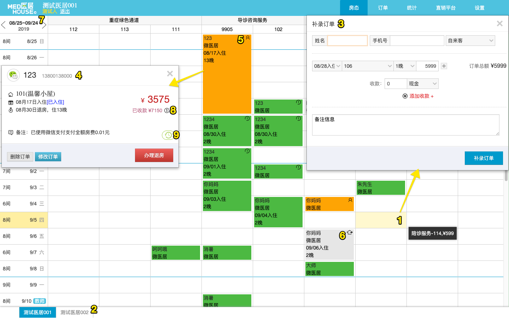
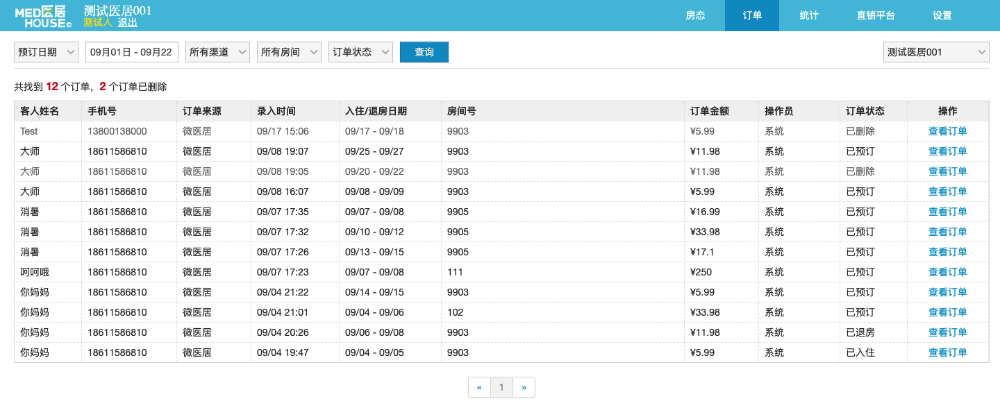

## 房态页

1. 空闲的间夜, 点击后会出现不同的表单框
2. 切换不同的医居
3. 如果在过去的某天点开, 则弹出`补录订单`, 补录的订单如果住到今天之前, 则直接是退房状态, 补录的订单如果住到今天以后, 则直接是入住状态; 如果在今天点开, 则弹出`预定订单`, 并且有`直接入住`按钮; 如果是在未来某天点开, 则弹出`预定订单`, 但是没有`直接入住`按钮. 如果从某个订单上点开, 则出现`编辑订单`
4. 如果是未入住的订单, 且在今天之前, 则可以办理入住. 如果已经是入住状态, 则可以办理退房, 如果入住时间范围大于退房时间, 则未住的时间段会被删除; 如果还没到入住日期, 则没有入住退房操作. 所有状态均可删除, 这点要尤其注意.
5. 已入住的订单会有小人的标识, 并呈现橙色(如果设置了渠道颜色, 则不同)
6. 已离店的订单会有房子的标识, 并呈现灰色
7. 切换日期后展示选择日期及其未来三十天的房态
8. 总收款, 鼠标放上会有收款记录
9. 点开会有订单日志

## 订单列表

订单页主要是按下单顺序查看, 和筛选订单的时候查看, 点击`查看订单`可以看到和房态页一样的详细信息, 而且这里可以看到已经删除的订单.