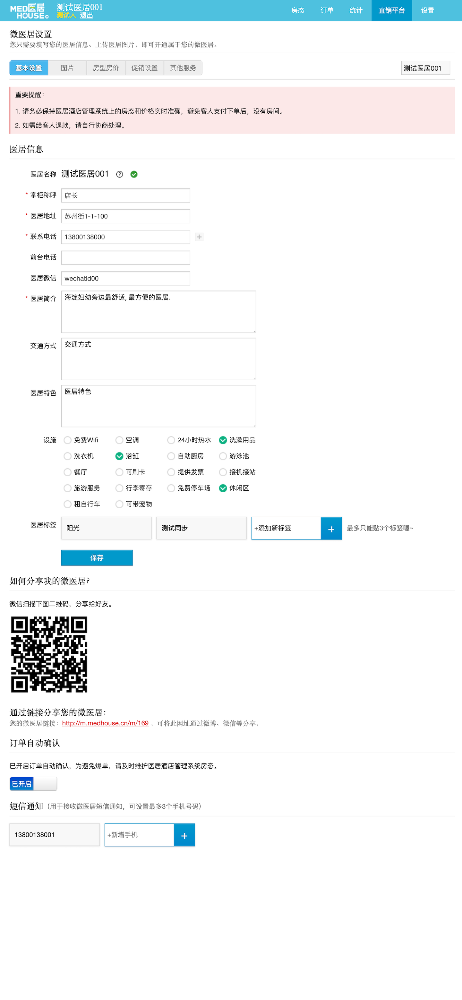

## 基本信息

- 直销平台默认是关闭的. 需要录入基本信息图片房型后点击开通
- `订单自动确认`如果关闭, 在 `m端`预定时会提示无法预定, 并显示预留的电话
- `短信通知`目前不生效

## 图片和促销设置

如果设置了时间段内n晚起订, 则在 `m端`预定时会给出限制

## 房型房价

- 需要打开指定的房型, 才可以在直销平台展示
- 可以设置 (0, 1], 一位小数的折扣
- 特色即描述为纯文本, 显示在`m端`房型标题下面
- 取消规则只是展示, 并不影响逻辑, `m端`无法申请取消, 取消需要和商家或平台沟通

## 其他服务

- `其他服务`作为一种单独的商品, 和房间区分开来, 有库存, 没时间维度的限制
- `其他服务`的订单也只能在这个页面进行查询
- 订单也会和房间订单一起生成结算单, 同一费率