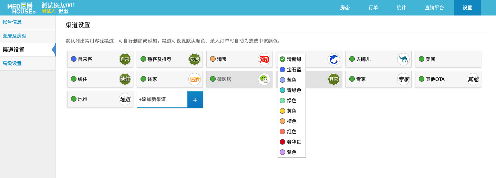

## 账号信息

1. 用于登录的账户, 刚注册时默认为手机号, 可以随意修改
2. 目前角色只有`掌柜`和`店员`, 只有一个掌柜
3. 新建的子账户都是`店员`, `店员`不验证手机号
4. 店员受权限控制, 掌柜拥有所有权限

## 房型房价

1. 一个账户最多建立 10 个医居, 在房态页底部切换
2. 层级关系是: 医居 > 房型 > 房间, 房价挂在房型上
3. 可以直接拖动房间到不同的房型
4. 可以在房态页面展示或隐藏
5. 修改医居所在区域(平台会用到这个), 还有类型(类型暂时没任何用途)
6. 删除不可恢复哦
7. 相当于在房态页, 直销平台都不可见了
8. 开启后下方拖动房型, 关闭后下方拖动房间, 影响的是房态页的相应顺序
9. 价格体系有两层, `平日价`和`周末价`, 以及价格日历中设置的`自定义价格`
10. 在有订单的情况下是不允许删除的

## 渠道设置

渠道主要是为了在房态页便于识别, 可以通过如图的下拉框设置不同的颜色, 这样在退房前就会有不同的颜色, 退房后仍然为灰色.

## 高级设置

1. 支付方式主要用在房态, 收款方式那块, 主要用于统计, 已经在使用的不允许删除
2. 结算信息一经填写无法自行修改, 需要在 mis 中修改, 这个主要用于结算打款
3. 很多地方都是这种操作方式, 比如统计那块也都是这个, 下拉即可切换医居

