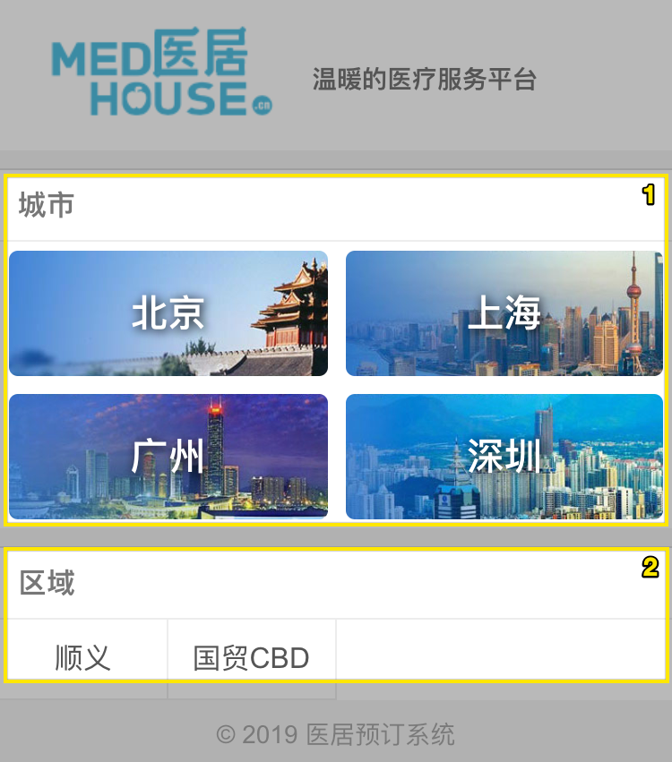
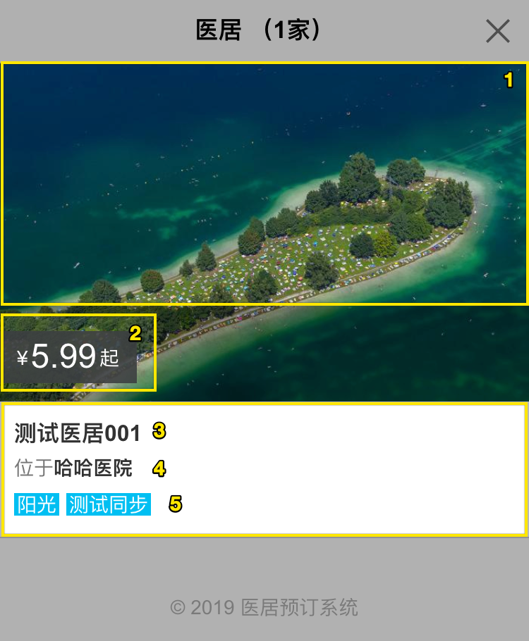

## 首页

需要在开通 EB 后, 再在直销平台内维护必要的信息, 开通直销平台后, 才可进入直销平台进行预订.

1. 城市列表, 此部分城市列表固定, 需要更改代码
2. 区域列表, 此部分列表, 可以在 mis 区域管理 处进行修改, 有医居的区域才会展示

## 医居列表

1. 医居的封面: EB > 直销平台 > 图片
2. 取当日最低价格
3. 医居名称
4. 所属区域, 注册时候的区域, 可以在 EB 修改: EB > 设置 > 医居及房型 > 修改医居
5. 医居标签: EB > 直销平台 > 基本设置 > 标签