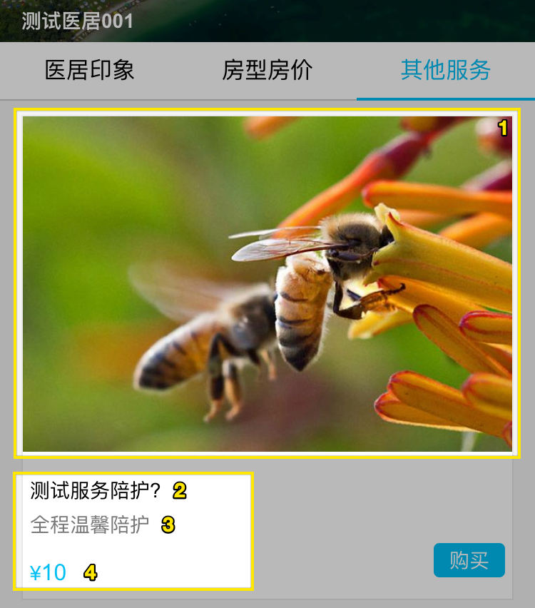

## 印象

1. 医居的封面: EB > 直销平台 > 图片
2. 医居名称
3. 维护其他服务信息后才会出现这个标签: EB > 直销平台 > 其他服务
4. 掌柜称呼: EB > 直销平台 > 基本设置
5. 电话: EB > 直销平台 > 基本设置
6. 地址: EB > 直销平台 > 基本设置, 如果设置了经纬度, 才会显示查看地图的链接, 目前经纬度只能在 mis 中维护
7. 医居微信: EB > 直销平台 > 基本设置
8. 相册: EB > 直销平台 > 图片
9. 标签: EB > 直销平台 > 基本设置
10. 简介: EB > 直销平台 > 基本设置
11. 设施: EB > 直销平台 > 基本设置
12. 电话: EB > 直销平台 > 基本设置

## 房型房价

在 EB 中设置好房型后, 并且在直销平台内打开了指定的房型, 在这里才会显示.

1. 点击后打开日期范围选择器
2. 房型的封面, 在 EB 直销平台内设置的图片
3. 房型名称
4. 房型介绍
5. 当日房价

## 其他服务

元素基本和房型的一致, 只是设置都在 EB 直销平台的其他服务内.