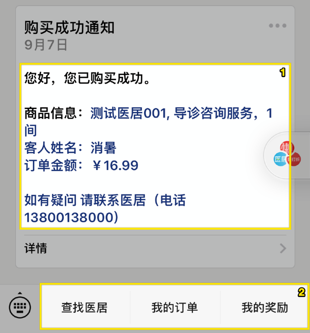
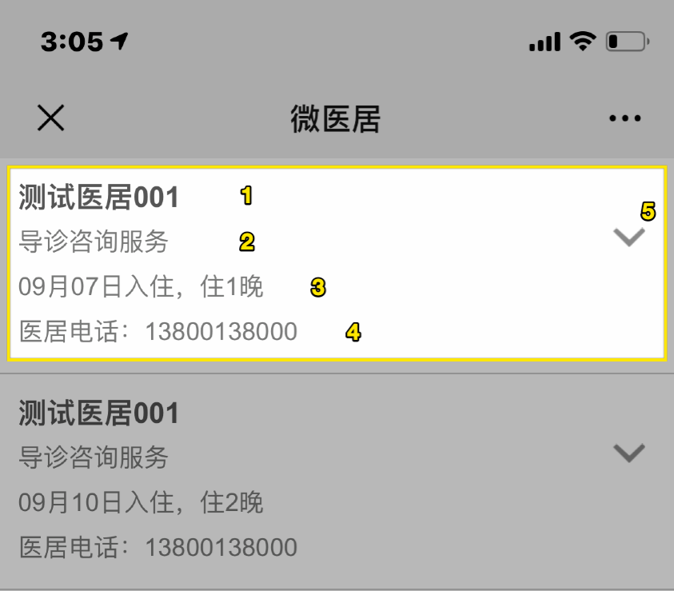
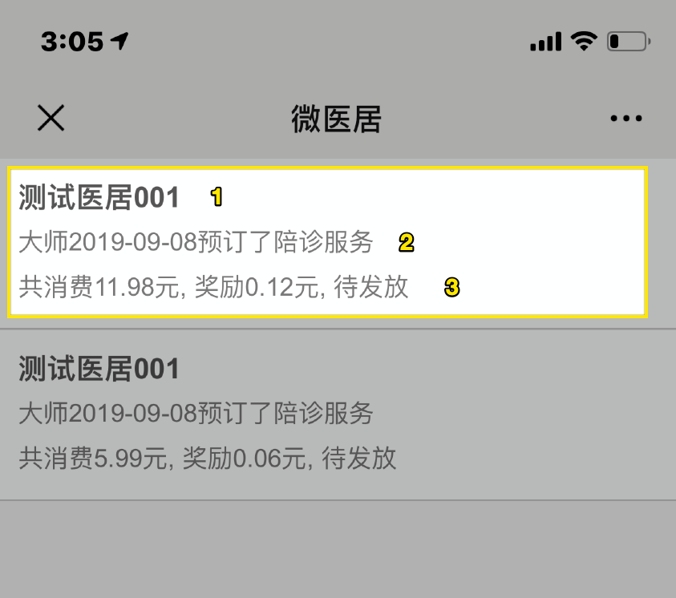

## 公众号

1. 在预订成功或失败时, 会发送模板消息. 消息内容元素为 `{医居名称}, {房型或物品名称}, {数量}, {客人姓名}, {订单金额}, {医居电话}`
2. 我的订单和奖励入口`(todo 需要调整入口)`

## 我的订单

1. 医居名称
2. 房型或服务名称
3. 入住信息
4. 医居电话
5. 点击后看到和预订结果一致的页面

## 我的奖励

1. 医居名称
2. `{昵称}{购买日期}{购买内容}`
3. `{消费金额}{奖励金额}{奖励状态}`