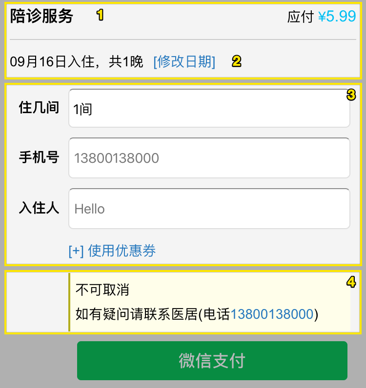
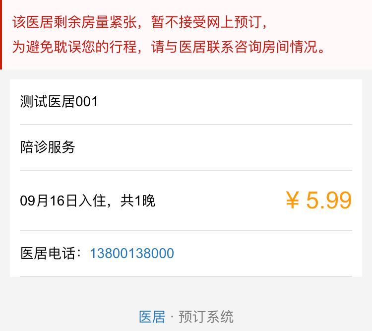
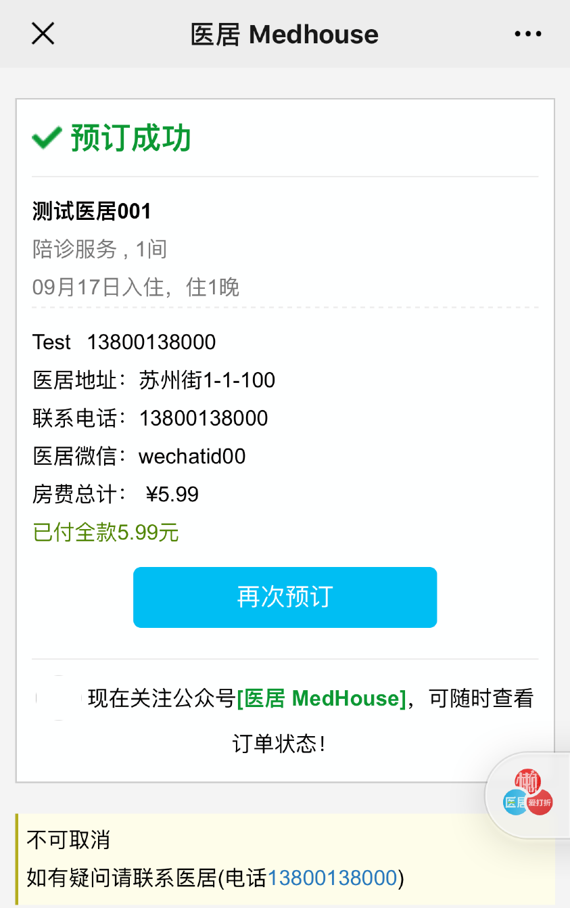

## 下单页

房和其他服务的下单页基本一致

1. 名称及其价格
2. 修改会弹出日历, 价格会随之更改
3. 购买人信息(优惠券功能暂时不可用)
4. EB 直销平台内设置的取消规则和电话

## 不可在线预订

如果在 EB 内直销平台模块设置了, 关闭了`自动确认`, 则会在下单时展示如上提示. 不支持支付预订.

## 下单结果

支付成功后, 会自动下单到 EB, 自动排房, 并展示给用户预订和支付信息, 如果发生预订失败(比如支付后无房), 该页面会显示失败, 并自动给用户退款. (也可能发生状态未知不自动退款的情况)