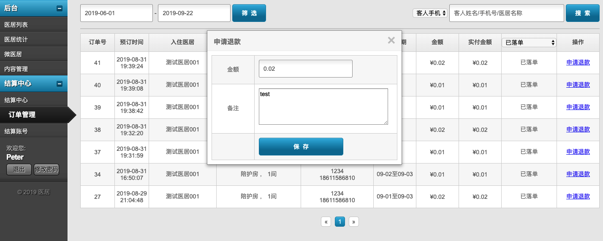

## 加入直销平台的医居列表

在`eb端`维护好信息开通后才会在这里看到.

1. 直接链接到直销平台指定医居主页
2. 可以编辑该医居的一些信息
3. 关闭后在直销平台里则不能看到, 可以再次开启

## 直销平台订单按日统计

每个医居每日的订单数列表, 点击明细可查看所有订单.

## 直销平台的订单管理

1. 默认只展示了下单成功的订单, 可以通过下拉框筛选更多
2. 发起退款申请操作, 弹出如下页面, 结算中心里需要`接受`或`拒绝`

申请的时候可以重新设置新的退款金额, 如果产生了奖金, 则要注意是否要用户承担. 如果已经结算给酒店, 则更要注意. 这种情况可能需要酒店自行退款给客人.

## 处理退款

退款注意点

- 在订单管理中提交申请, 填写想退的金额
- 到结算中心里处理退款, 接受或拒绝
- 即使完成退款, EB 内的订单也不会自动删除, 因为 EB端可能已经做了更改, 所以目前的退款都需要买卖双方线下确认后, MIS 端退款仅作为资金的操作步骤.

1. 这是提交申请时的备注
2. 实际调用退款接口的处理结果状态
3. 这个退款申请的审核结果
4. 审核动作, 弹出如下窗口

1. 接受退款请求: 后续自动调用微信接口完成退款
2. 拒绝这次退款申请: 不会退款给用户, 订单可再次发起退款
3. 接受退款请求: 不会调用微信接口, 订单置为退款状态 (比如账户异常无法自动退下线退完, 可以点击这个修改订单状态)

## 结算给商户

结算注意点:

- 每日凌晨2点自动生成前一日的账单
- 手续费暂设为了 3%
- 目前无法调用打钱接口, 只可手动打款. 待开通微信转账到银行卡功能后, 需要开发对应功能, 到时候再看流程
- 手动打款后需要点击打款完成, 这样 eb 和 mis 才能知道已经结算了对应的款项

1. 系统外打款后, 直接点击`结算完成`把当前条目标记为已结算